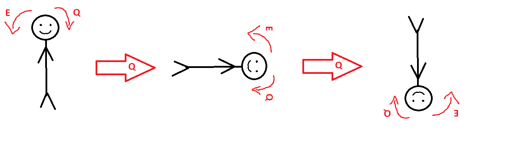

# OpenGL - Key Callback

## Description:
This project allows simple camera movements for OpenGL projects

Unfortunately the source code can't be used as is, it is just a reference for standard OpenGL projects.

## Keys:
- ### Camera shift
    - Use WASD to move 
        - W forward
        - S backward
        - A left
        - D right
    - Use Space to ascend
    - Use C, Shift or Left to descend
- ### Camera Yaw
    - Use Left Arrow to look left
    - Use Right Arrow to look right
- ### Camera Pitch
    - Use Up Arrow to look up
    - Use Down Arrow to look down
- ### Camera Roll
    - Use Q to rotate your camera clockwise
    - Use E to rotate your camera counter-clockwise
    
## Additional Keys:
- ### Reset
Use R to Reset camera position to initial values
- ### Precision
Use Caps Lock to toggle precision mode, which slows down the movement & rotation

## Visual Representation:
- ### Camera shift (Move Up & Down & Left & Right & Top & Bottom)

- ### Camera Yaw (Look Right & Left)

- ### Camera Pitch (Look Up & Down)

- ### Camera Roll (Rotate Clockwise & Counter-Clockwise)

## References:
- https://en.wikipedia.org/wiki/Aircraft_principal_axes
